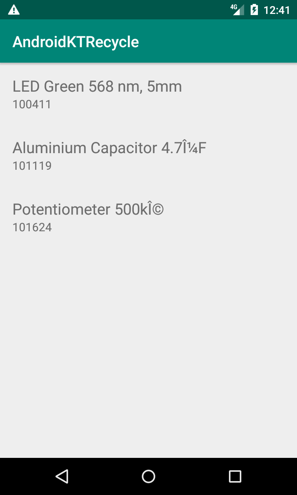
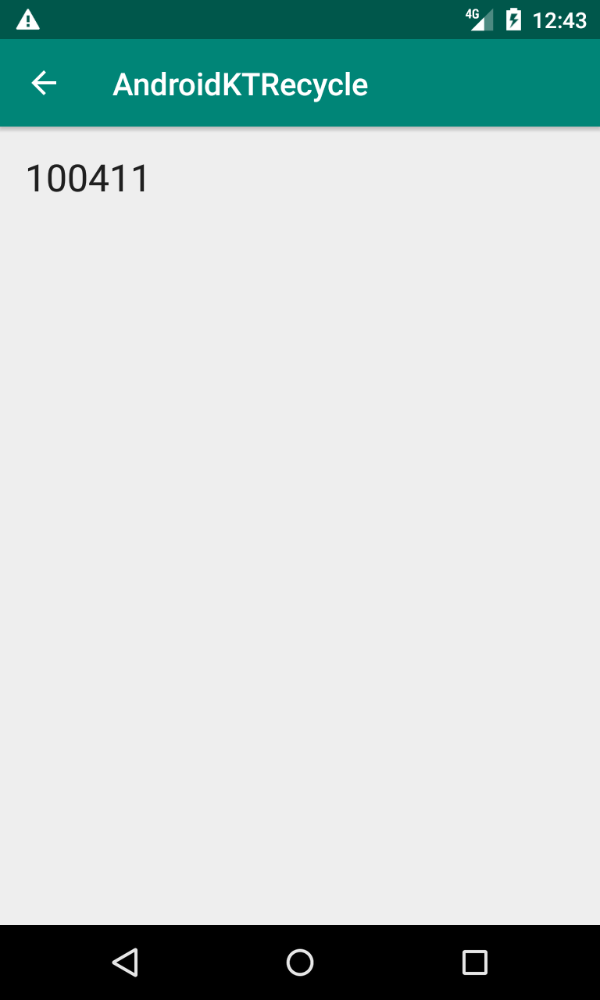

# Intro

To get a handle on the power of Kotlin, I choose to customize RecycleView using functions,lambdas, and high-order features of Kotlin.

# Why

As a Senior Android Developer we often are tasked with picking p new technologies to allow us to develop faster and asier and this is the case with Kotlin.
I can develop android apps faster with Kotlin and Kotlin allows me to do such things as Java Types faster and easier.

# The Details

In several places I am using Kotlin functions, lambdas and High Order Kotlin features such ss this in the MainActivity to make things easier to implement:

testFunctionParameters( {a : Int, b : Int -> a + b } )

which us calling:

class ClassWithConstructorProperties constructor (var a: Int, var b: Int) {
        fun calculate() : Int {
            return a + b;
        }
    }

    private fun testFunctionParameters(performCalculation: (Int, Int) -> Int) {
        Log.d("Tests", "Calculation result: " + performCalculation(1, 2))
    }

It takes a little time to comprehend because most java developers have no functional programming experience. Lambdas as just annonymous fucntions that since they do not belong to a class can be used throughtout the application classes just lliek we normally have in any modern scripting language.
The reason this is powerfull is that we than are not forced to re-define a function in each class we want touse it  in or to couple classes together to use that function in another class.

# Screenshots

## MainActivity

## PartDetailActivity

